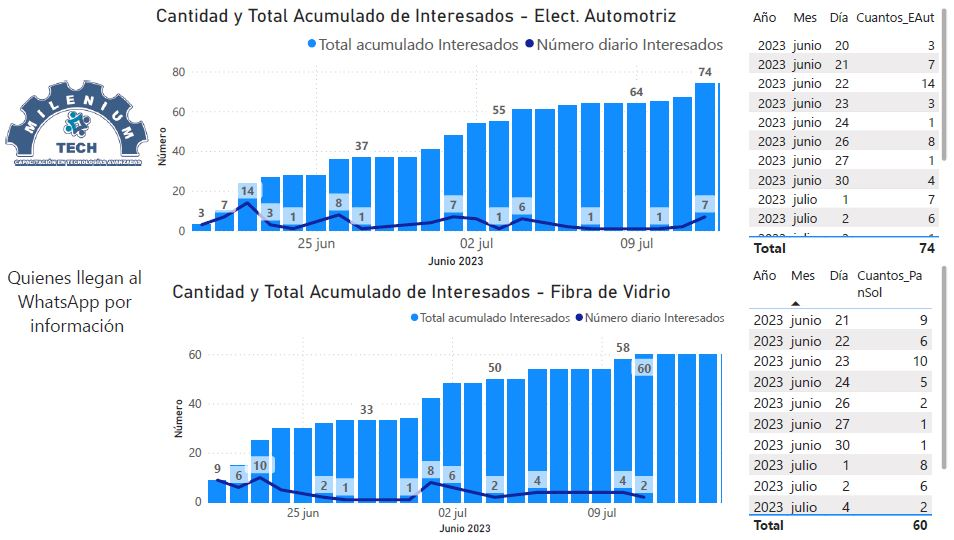
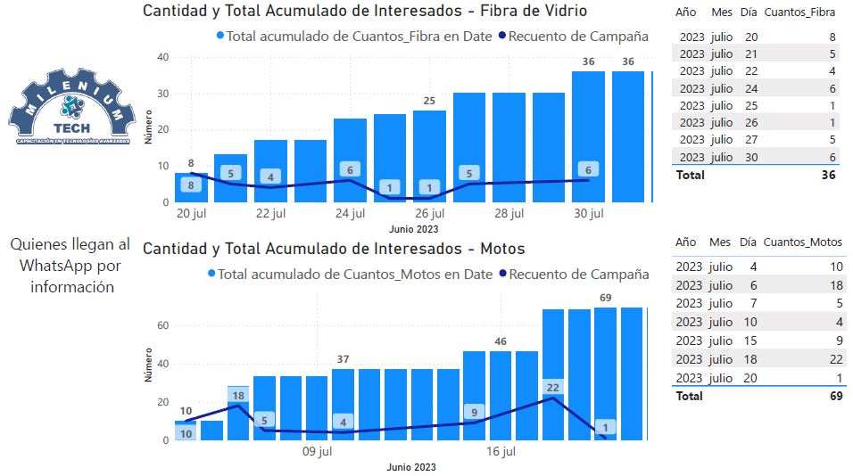
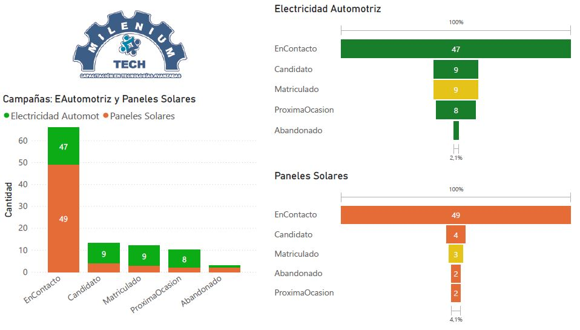
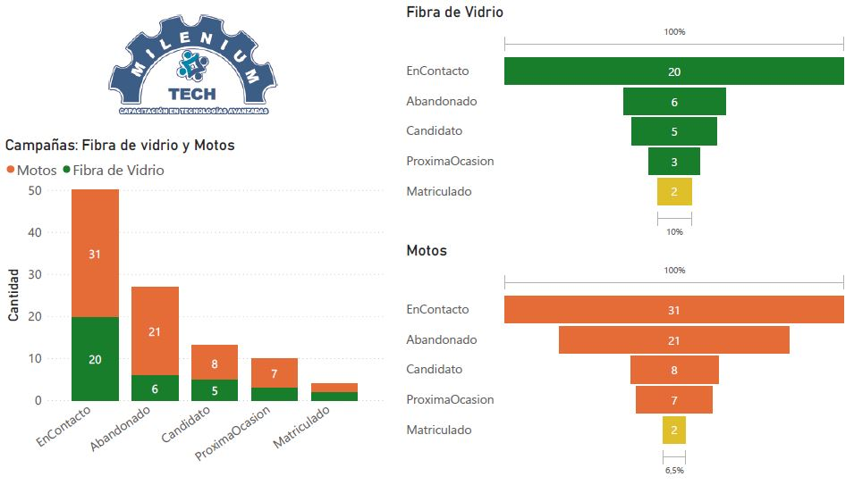
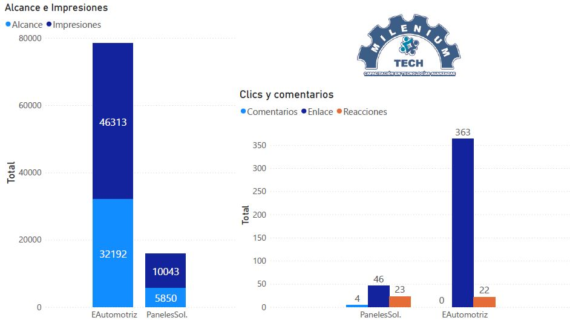
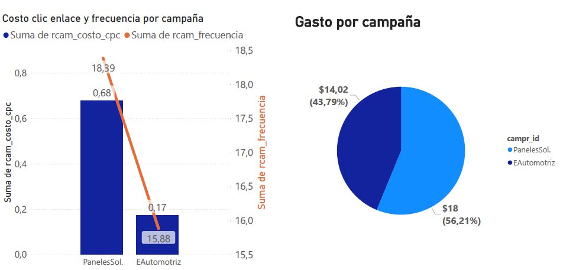

# PowerBI-MarketingCampaigns-Jun2023-MT

<h1><a href="https://powerbi.microsoft.com/" target="blank" rel="noopener noreferrer"># <i>PowerBi<i></a></h1>

<h1> Data visualization of Marketing Campaigns by using Power BI</h1>

Milenium Tech is an education enterprise in the mechanic and automotive areas that requires to attract new students that want to study in their innovative courses.

By means of support of a new marketing team of strategies: marketers, publishers, and community managers. Social media has been one of the principal tools to launch campaigns and be shown to the public about the new courses that Milenium Tech Institute has prepared for the public. Facebook has been selected as the main social media and the community management team has required to measure how advisement posts are performing.

For that, the enterprise has one CRM software where the data is stored and managed in the Postgres program. With the SQL commands the necessary data is downloaded and then pre-processed in a script of Python, specifically in Notebook.

The data is transformed into new data and then it's extracted by ETL processes in the Power BI tool for developing the dashboards and dynamic insights that the marketing team needs to visualize. Even more it was required to create a data model and use DAX functions based on the calendarauto() function in order to see the series time of the registers

<h3>List of insights</h3>

<ol type = "1">
  <li>Record of leads or interested that requested information for Automotive Electricity and Solar Panels</li>
  <li>Record of leads or interested that requested information for Fiberglass Repair and Motorcycles</li>
  <li>Funnel Sales for the courses of Automotive Electricity and Solar Panels</li>
  <li>Funnel Sales for the courses of Fiberglass Repair and Motorcycles</li>
  <li>Reach and Impressions for the courses of Automotive Electricity and Solar Panels</li>
  <li>Cost through clic (CTC) and Expenses by Campaign</li>  
</ol>

<h3>1. Record of leads or interested that requested information for Automotive Electricity and Solar Panels</h3>
This is a Time Series Graphic and table that show the number of leads that reach out for asking information and be interested in Automotive Electricity and Solar Panels.
<blockquote>
  
</blockquote>

<h3>2. Record of leads or interested that requested information for Fiberglass Repair and Motorcycles</h3>
This is a Time Series Graphic and table that show the number of leads that reach out for asking information and be interested in Fiberglass Repair and Motorcycles.
<blockquote>
  
</blockquote>

<h3>3. Funnel Sales for the courses of Automotive Electricity and Solar Panels</h3>
On the left side, we have stacked bars showing an explanation of funnel sales, the same is for the right side. 
<blockquote>
  
</blockquote>

<h3>4. Funnel Sales for the courses of Fiberglass Repair and Motorcycles</h3>
On the left side, we have stacked bars showing an explanation of funnel sales, the same is for the right side.
<blockquote>
  
</blockquote>

<h3>5. Reach and Impressions for the courses of Automotive Electricity and Solar Panels</h3>
On the left side, we have Reaches and Impressions by course, and on the right side we have comments, clicks on link and reactions.  
<blockquote>
  
</blockquote>

<h3>6. Cost through clic (CTC) and Expenses by Campaign</h3>
It describes the cost by click in average by each course, and campaign expenses. 
<blockquote>
  
</blockquote>
